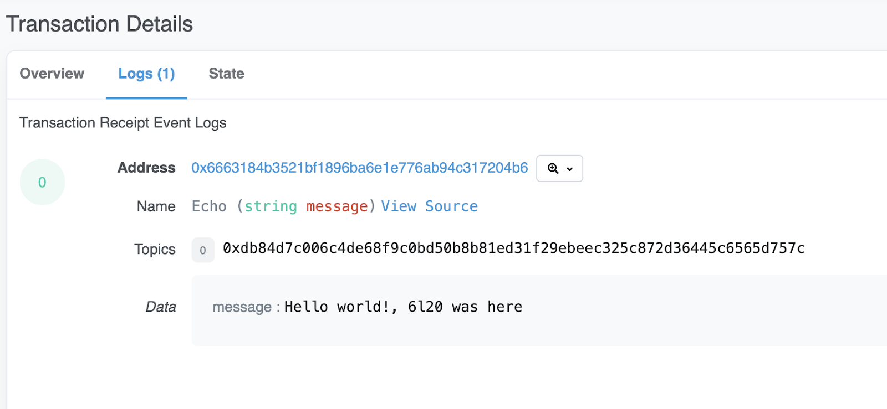

# Send an Infura ITX meta-transaction

This tutorial walks you through signing a meta-transaction with Quorum Key Manager (QKM) and sending it to Infura
Transactions (ITX).
This tutorial is an extension of the [Connect to an Infura endpoint tutorial](ConnectInfura.md) and uses the Rinkeby testnet.

## Prerequisites

Follow steps 1 to 5 in the [Connect to an Infura endpoint tutorial](ConnectInfura.md).
This gives you an Ethereum account with a new address.

## Steps

1. Fund your Ethereum account.
   For example, you can go to the [Rinkeby faucet](https://www.rinkeby.io/#faucet) and follow the instructions there.
   You can use Etherscan to check that the faucet gave you ETH.

1. Deposit ETH into the Infura deposit contract using QKM `infura-node`.
   The following example uses the sample deposit contract `0x015C7C7A7D65bbdb117C573007219107BD7486f9`:

    === "curl HTTP request"

        ```bash
        curl --location --request POST 'https://localhost:8080/nodes/infura-node' \
            --header 'Authorization: Basic YWRtaW4tdXNlcg==' \
            --header 'Content-Type: application/json' \
            --data-raw '{"jsonrpc":"2.0","method":"eth_sendTransaction",
                "params":[
                    {"from": "<MY_ETH_ACCOUNT_ADDRESS>",
                    "to": "0x015C7C7A7D65bbdb117C573007219107BD7486f9",
                    "gas": "0x65000",
                    "gasPrice": "0x1000000000",
                    "value": "0x1000000000000000"}
                    ], "id":3
                }
                '
        ```

    === "JSON result"

        ```bash
        {
            "jsonrpc": "2.0",
            "result": "0xff1bd105d7254789b6fc5e18639e2395068108d66bcfe728e5f792295b7526be",
            "error": null,
            "id": 3
        }
        ```

    The response yields the transaction hash for the successful deposit.
    You can use Etherscan to check that the deposit went through:

    

1. Build a message to be sent to a test contract.
   In this example, the message is `Hello world!, 6l20 was here`, which translates to the following Ethereum message:

    ```text
    0xf15da7290000000000000000000000000000000000000000000000000000000000000020000000000000000000000000000000000000000000000000000000000000001b48656c6c6f20776f726c64212c20366c32302077617320686572650000000000
    ```

    The hash of the Ethereum message is:

    ```text
    bf11b3f509e51cbb52070358c5bfadd9047ee9750e865f8f1b1ad125df65e853
    ```

1. Use QKM to sign the message hash, replacing `<MY_ETH_ACCOUNT_ADDRESS>` with your Ethereum account address:

    ```bash
    curl --location --request POST 'https://localhost:8080/stores/eth-accounts/ethereum/<MY_ETH_ACCOUNT_ADDRESS>/sign-message' \
        --header 'Authorization: Basic YWRtaW4tdXNlcg==' \
        --header 'Content-Type: application/json' \
        --data-raw '{
            "message": "0xbf11b3f509e51cbb52070358c5bfadd9047ee9750e865f8f1b1ad125df65e853"
        }'
    ```

    This gives you a valid signature, such as:

    ```text
    0xd4a7151261d815cd2720632b9e9949fd141e5059321bb8f23e621a944dd1081533acef9d1a318b3b60c2815385ba7e3ca59adee6490113c5a71913735acbeb8b1c
    ```

1. Send the message using ITX, replacing `<YOUR_QKM_SIGNATURE>` with the signature from the previous step.
   In this example, the message is sent to the address `0x6663184b3521bF1896Ba6e1E776AB94c317204B6`:

    === "curl HTTP request"

        ```bash
        curl --location --request POST 'https://rinkeby.infura.io/v3/d23bcbc0d01e422b81fb118544fbd7af' \
            --header 'Content-Type: application/json' \
            --data-raw '{
                "jsonrpc": "2.0",
                "method": "relay_sendTransaction",
                "params": [
                    {
                        "to": "0x6663184b3521bF1896Ba6e1E776AB94c317204B6",
                        "data": "0xf15da7290000000000000000000000000000000000000000000000000000000000000020000000000000000000000000000000000000000000000000000000000000001b48656c6c6f20776f726c64212c20366c32302077617320686572650000000000",
                        "gas": "100000",
                        "schedule": "fast"
                    }, "<YOUR_QKM_SIGNATURE>"
                ], "id": 5
            }'
        ```

    === "JSON result"

        ```json
        {
           "jsonrpc": "2.0",
           "id": 5,
           "result": {
               "relayTransactionHash": "0xbf11b3f509e51cbb52070358c5bfadd9047ee9750e865f8f1b1ad125df65e853"
           }
        }
        ```

1. Check that the transaction has been mined.
   The Infura `relay_transactionHashes` method doesn't translate directly to Ethereum transaction hashes, so you must
   use the Infura `relay_getTransactionStatus` method to get the Ethereum transaction hash:

    === "curl HTTP request"

        ```bash
        curl --location --request POST 'https://rinkeby.infura.io/v3/d23bcbc0d01e422b81fb118544fbd7af' \
            --header 'Content-Type: application/json' \
            --data-raw '{
                "id": 7,
                "jsonrpc": "2.0",
                "method": "relay_getTransactionStatus",
                "params": [
                    "0xbf11b3f509e51cbb52070358c5bfadd9047ee9750e865f8f1b1ad125df65e853"
                ]
            }'
        ```

    === "JSON result"

        ```bash
        {
            "jsonrpc": "2.0",
            "id": 7,
            "result": {
                "broadcasts": [
                    {
                        "broadcastTime": "2021-11-22T21:54:34.993Z",
                        "confirmations": 2642,
                        "ethTxHash": "0x201722d7bb647ff94bb6f9c43aa4ad2c0eb2a6d808c04cf2cff8f207bd794d74",
                        "gasPrice": "10420000100"
                    }
                ],
                "receivedTime": "2021-11-22T21:54:30.606Z"
            }
        }
        ```

    Using the `ethTxHash` result as the transaction hash, you can go to
    `https://rinkeby.etherscan.io/tx/<ethTxHash>#eventlog` to validate that your message is found and the transaction
    has been properly signed and relayed.

    

You can find more information about sending meta-transactions in the [ITX samples repository](https://github.com/INFURA/demo-eth-tx/tree/master/infura-transactions).
